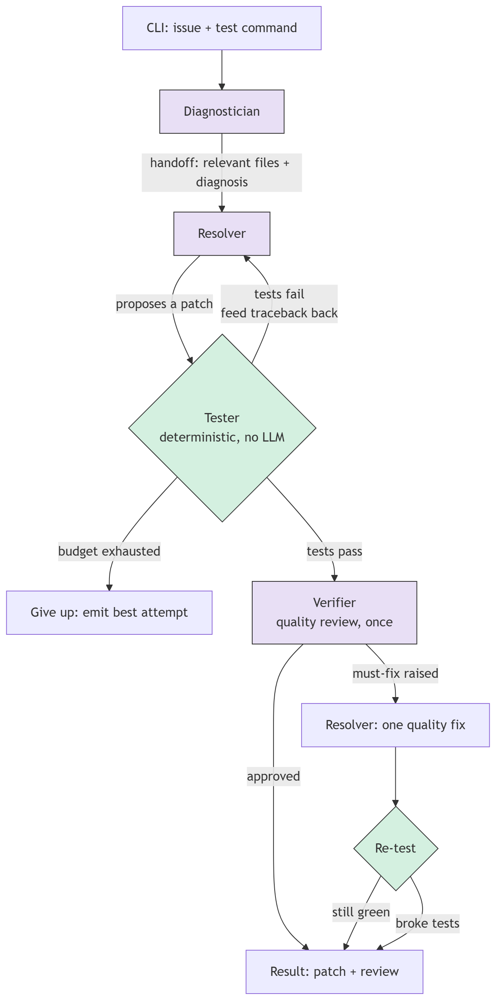

# Remedy

A self-verifying coding agent that resolves GitHub issues by editing a repository and running its tests until they pass — then reviewing its own fix for quality.

Given an issue and a test command, Remedy locates the relevant code, proposes a minimal fix, runs the tests, and iterates on the failures until they go green. Only once the tests pass does a separate agent review the working fix for quality and scalability. The whole thing runs as a CLI, and the tools it acts through are exposed as an MCP server so any MCP client can drive them too.

## How it works

Remedy is three reasoning agents plus a deterministic tester, coordinated by a hand-rolled control loop. Correctness and quality are deliberately separated: the fix has to actually pass the tests before anyone looks at its style.



### The agents

**Diagnostician** — runs once. Explores the repo (search, directory listing, file reads) to locate which files are responsible and why, then hands off a structured diagnosis. It does not fix anything; it only localizes.

**Resolver** — the fixer, and it works _blind to the test source_. It only ever sees the runtime failure output (the traceback), never the test code itself. This is deliberate: it forces the agent to fix the underlying bug rather than pattern-match against the assertions. It aims for a minimal, root-cause change, not a refactor. If the diagnosis is unclear, it can ask the Diagnostician a bounded number of follow-up questions.

**Tester** — not an agent. Plain deterministic code that runs the test command and returns pass/fail plus the traceback. It is the single source of ground truth in the system, so it is intentionally _not_ an LLM — the one thing that decides success can never hallucinate.

**Verifier** — runs once, and only on code that has already passed the tests. Its job is a quality review of a working fix: does the fix generalize, is it a hack that only satisfies the visible tests, is the design reasonable? It raises must-fix items only for real problems; style notes are advisory. Judgment is proportional to the bug — a one-line fix does not get a SOLID refactor demanded of it.

### Key design decisions

- **Correctness before quality.** The Verifier is _not_ in the fix loop. The Resolver loops with the Tester until green, then the Verifier reviews once. This avoids wasting iterations reviewing broken code for style.
- **Blind resolver.** The Resolver never sees test source, only failures. This is the primary defense against a fix that games the tests instead of fixing the bug.
- **Deterministic tester.** Ground truth stays out of the LLM's hands.
- **Hand-rolled loop, no agent framework.** The control flow is a small state machine in plain Python. The orchestration is the interesting part of the project, so it isn't hidden behind a framework.
- **Structured outputs via terminal tools.** Each agent finishes by calling a schema-validated tool (`submit_diagnosis`, `submit_fix`, `submit_review`) rather than emitting free text that gets regex-parsed. The API enforces the output shape.
- **Tools exposed over MCP.** The file/search/edit/test tools are a real MCP server, so the same toolset drives both Remedy's own loop and any external MCP client.
- **Bounded budgets.** Every loop has a cap; on exhaustion Remedy emits its best attempt rather than looping forever (see below).

### Budgets

An agent that can edit code and run tests in a loop needs hard stops, or a hard bug turns into an infinite loop and an unbounded API bill. Remedy has three independent caps, each guarding a different loop:

- **`max_iterations`** (default 5) — the outer correctness loop: how many Resolver → Tester cycles run before Remedy gives up. This is the main budget. If the tests never go green within the cap, the run ends and Remedy emits its best attempt so far rather than looping forever.
- **`max_turns`** (default 15) — inside a _single_ agent call, how many tool-call rounds it gets before being forced to finish. This bounds one Diagnostician/Resolver/Verifier invocation, not the whole run. On the final turn the agent is explicitly told to submit, so a long investigation can't silently run out mid-exploration without recording its findings.
- **`max_clarifications`** (default 2) — how many follow-up questions the Resolver may ask the Diagnostician before that channel is cut off, so the two agents can't ping-pong indefinitely.

These are deliberately separate rather than one global counter, because they fail for different reasons: hitting `max_iterations` means the fix isn't converging, hitting `max_turns` means a single agent is spinning, and hitting `max_clarifications` means the diagnosis was too unclear to act on. Keeping them distinct makes a failed run diagnosable from the trajectory. Only `max_iterations` is exposed as a CLI flag; the others are tuned defaults.

## Install

Requires Python 3.10+, and [ripgrep](https://github.com/BurntSushi/ripgrep) on your PATH for code search.

```bash
git clone <your-repo-url>
cd remedy
pip install -r requirements.txt
pip install -e .
```

`pip install -r requirements.txt` installs the dependencies; `pip install -e .` installs Remedy itself and registers the `remedy` and `remedy-mcp` commands on your PATH.

## Usage

```bash
remedy \
  --repo path/to/project \
  --issue-file issue.txt \
  --test-cmd "pytest tests/test_foo.py -q" \
  --test-path tests/test_foo.py
```

On first run, if no key is found, Remedy prompts you once for your Anthropic API key, validates it, and saves it to `~/.remedy/config.json` so later runs don't ask again. You can also set `ANTHROPIC_API_KEY` in your environment, which takes precedence over the saved key. Key flags:

- `--repo` — the project to fix.
- `--issue` / `--issue-file` — the issue text, inline or from a file.
- `--test-cmd` — how to run the tests (any language: `pytest`, `npm test`, `go test`, etc.).
- `--test-path` — test file(s) the Resolver and Verifier are blocked from reading (repeatable).
- `--diagnostician-model` / `--resolver-model` / `--verifier-model` — per-agent model selection. All default to `claude-sonnet-5`; you can point any agent at a different model (for example, a cheaper model for the Resolver, which runs most often).
- `--max-iterations` — cap on the correctness loop.
- `--output` — where to write the full result JSON.

### API key

Remedy needs an Anthropic API key. It's resolved in this order:

1. The `ANTHROPIC_API_KEY` environment variable, if set (useful for overriding per-shell or in CI).
2. The saved key in `~/.remedy/config.json`.
3. If neither exists, Remedy prompts you for it, validates it against the API, and saves it for next time — so you're only asked once. An invalid key is rejected on the spot rather than saved.

The result JSON contains the final `resolved` status, the `patch` (a unified diff computed by snapshotting files before and after — no git required), the diagnosis, the quality review, and a full `trajectory` of every agent decision and tool call for inspection.

## Tools as an MCP server

The same tools Remedy uses internally are exposed as an MCP server:

```bash
remedy-mcp
```

Point any MCP client (Claude Desktop, etc.) at it to drive `read_file`, `search_code`, `list_directory`, `apply_edit`, and `run_tests` directly.

## Example projects

`dummy-projects-for-testing/` contains two small projects with planted bugs, used to exercise Remedy end to end. Each includes an `issue.txt` (the bug report handed to Remedy) and a test file that fails on the bug.

**`order-system/`** — a small Python pricing engine split across four files (`catalog.py`, `pricing.py`, `utils.py`, `orders.py`). The bug is a rounding error that only surfaces on multi-item orders with a discount: `orders.py` sums raw unrounded line totals instead of rounding each line first, so floating-point residue occasionally tips the final cent the wrong way. No single file looks wrong on its own — the bug lives in how the files compose, so fixing it requires tracing the whole catalog → pricing → discount → tax pipeline. It's the harder of the two, and a good test of the Diagnostician's multi-file localization.

**`todo-react-app/`** — a minimal Vite + React todo app. The bug is inverted filter logic in `TodoList.jsx`: clicking "Active" shows completed todos and vice versa. Single-file and self-contained, and it demonstrates that Remedy is language-agnostic — the fix is verified with `npm test` (Jest) rather than pytest, since the tester just runs whatever test command it's given.

To run Remedy against one of them:

```bash
remedy \
  --repo dummy-projects-for-testing/order-system \
  --issue-file dummy-projects-for-testing/order-system/issue.txt \
  --test-cmd "pytest tests/test_orders.py -q" \
  --test-path tests/test_orders.py
```

## Project layout

```
remedy/
├── cli.py            CLI entry point (Typer)
├── engine.py         the solve() control loop
├── config.py         API key persistence
├── mcp_server.py     tools exposed over MCP
├── agents/
│   ├── base.py       shared tool-calling loop
│   ├── diagnostician.py
│   ├── resolver.py
│   └── verifier.py
└── tools/
    ├── file_ops.py   read_file, list_directory
    ├── search.py     search_code (ripgrep)
    ├── edit.py       apply_edit
    ├── testing.py    run_tests (deterministic)
    └── diffing.py    before/after snapshot diff
```

## Status

Working end to end on multi-file bugs. Benchmarking on SWE-bench-lite is the next step.
